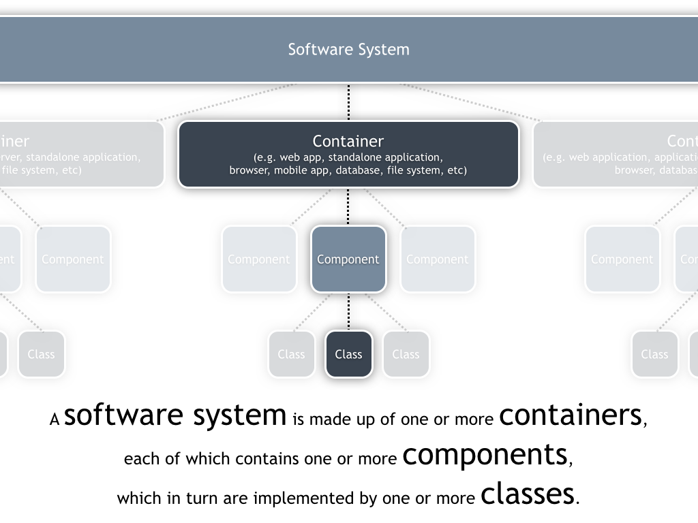
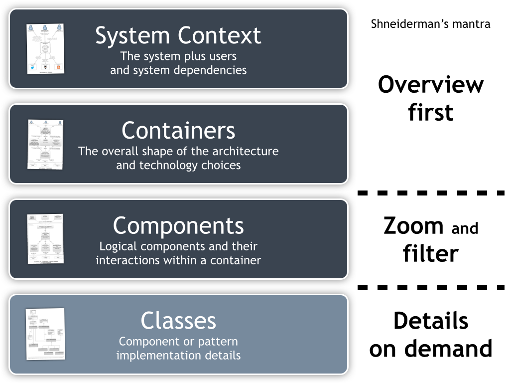

## Introdução à arquitetura de software

Ou "Dicas para organizar um projeto de software".

### Requisitos

O objetivo de definir requisitos de qualidade é diminuir os riscos durante o desenvolvimento de um software, evitando ter de corrigir erros no final do projeto (onde esses erros são mais caros).

#### Checklist para avaliar requisitos

O tipo de requisito que você vai precisar no seu projeto depende muito das características específicas do mesmo. No entanto, essas perguntas ajudam a ter uma ideia sobre quais requisitos são mais importantes e se a equipe não está esquecendo de nada.

#### Checando a funcionalidade dos requisitos

- Todos os inputs estão especificados (origem, tipo, precisão, valores)?
- Todos os outputs estão especificados (destino, precisão, valores, formato)?
- As interfaces entre hardware e software estão especificadas?
- Todas as tarefas que o usuário pode realizar estão especificadas?
- Os dados necessários para cada tarefa e resultantes dela estão especificados?

#### Checando a qualidade dos requisitos

- Os requisitos estão escritos na linguagem do usuário? Um jogador os entenderia?
- Cada requisito evita conflito com outros requisitos?
- Trocas entre requisitos que possam competir entre si estão especificadas?
- Os requisitos evitam definir um design específico?
- Todos os requisitos estão num nível consistente de detalhe? Alguns deveriam estar mais ou menos detalhados?
- Os requisitos estão claros o suficiente que poderiam ser entregues a outro grupo para serem construídos? 
- Cada item é relevante à solução do problema? É possível traçar a origem de cada item em relação ao problema sendo resolvido?
- É possível testar cada requisito? Testes independentes serão capazes de verificar se cada item foi satisfeito?
- As possíveis mudanças aos requerimentos foram especificadas, incluindo a probabilidade de que ocorram?

#### Checando a completude dos requisitos

- As informações que ainda não estão disponíveis no início do projeto estão marcadas?
- Se todos os requisitos forem satisfeitos, o produto será considerado completo?
- Você está confortável com todos os requisitos? Já foram eliminados requisitos que são impossíveis de implementar ou criados por motivos irrelevantes?

### Arquitetura

A arquitetura de um software (ou de um sistema) refere-se a restrições e decisões que se aplicam ao sistema como um todo e não apenas partes dele. Ela provém a estrutura necessária para manter a integridade conceitual de um sistema desde os níveis mais altos até os mais baixos. Ela facilita a divisão de trabalho, permitindo que desenvolvedores trabalhem em paralelo e coletivamente.

Esse é um tema multi-facetado e complexo, então vamos listar alguns dos componentes a serem considerados.

#### Organização do programa

Explica em termos amplos a organização interna do programa, assim como as justificativas para o mesmo, definindo os blocos principais de construção do programa. Também devem ser definidas as responsabilidades de cada bloco, de forma que todos os requisitos listados anteriormente devem estar cobertos.

####  Principais classes

A arquitetura deve identificar as principais classes a serem usadas e suas responsabilidades, assim como uma explicação da hierarquia de classes, transições e persistência de objetos. Ela não precisa especificar todas as classes do sistema, procure definir pelo menos os 20% mais importantes (que determinam 80% do comportamento do programa).

#### Estruturas e design de dados

A arquitetura deve também descrever as principais fontes de informação, a persistência dessa informação, quais blocos têm acesso a essa informação, mas mantendo-se numa descrição de alto nível. Dessa forma, a responsabilidade de realizar o design das características concretas do sistema ainda são dos desenvolvedores finais.

#### Interface de usuário

A arquitetura deve especificar os principais elementos (ou conjuntos) presentes na interface do usuário. Se possível, deve especificar como tornar o sistema modularizado o suficiente para permitir alterações mais adiante e trocas de interface sem maiores problemas.

#### Gerenciamento de recursos e performance

A arquitetura deve delinear um plano para como lidar com as limitações de recursos, como memória, gráficos, canais de som e outros. Ela também deve prever estimativas de performance e justficativas para as mesmas. Essa definição deve ser clara o suficiente para evitar desperdício de trabalho mais adiante no processo.

#### Escalabilidade e interoperabilidade

A arquitetura deve definir o quanto o sistema deve estar hábil a crescer de acordo com demandas futuras e como ralizá-lo (em um nível de especificação alto). Isso é fundamental quando pensamos em multijogador ou sistemas com bancos de dados. O mesmo vale para a capacidade do sistema de compartilhar dados e recursos com outras plataformas: quais serão essas e como o sistema irá fazê-lo devem ser descritos.

#### Internacionalização

É preciso descrever como o sistema vai lidar com a questão da localização e da internacionalização de seu conteúdo e interfaces. 

#### Processamento de erros e tolerância

A arquitetura também é responsável por definir como o programa vai tratar de erros em suas diversas partes, assim como qual será a abordagem assumida pelas classes e sistemas. 

- O processamento de erros será corretivo ou apenas detecção?
- É uma detecção passiva ou ativa? O rpgroama vai tentar ativamente checar erros ou vai postergar essa checagem?
- Como o programa propaga erros? Ele trata localmente ou repassa para uma classe específica?
- Quais são as convenções a ser seguidas nas mensagens e tratamento de erros?
- Onde serão criadas `exceptions` e em que nível do programa serão os erros tratados?
- Qual é a responsabilidade de cada classe em relação a seus inputs e outputs?
- Serão criadas ferramentas próprias ou ferramentas do seu ambiente de desenvolvimento?

#### Viabilidade da arquitetura

A arquitetura deve demosntrar que o sistema é tecnicamente viável com os recursos existentes, ambientes de desenvolvimento e outras limitações do projeto. As alternativas e questões onde essa viabilidade está em risco devem ser justificadas e testadas através de protótipos, pesquisa e provas de conceito.

#### Checando a qualidade da arquitetura

- A arquitetura cobre todos os requisitos?
- Alguma parte está sobre ou sub especificada?
- A arquitetura como um todo forma um conjunto conceitual?
- O design de alto nível é independente do hardware e software que vai construí-lo?
- As motivações de todas as grandes decisões estão explicadas?
- Você, como programador, está confortável com a arquitetura que vai implementar?

### Processo de design de software (C4)

A estrutura básica desse processo (que pode ser chamado de C4, como definido por Brown (2015)) é:

1. Contexto: onde o sistema está loxalizado, em relação a usuários e outros sistemas
2. Containers: diferentes executáveis e processos, bancos de dados e entidades dentro do sistema
3. Componentes: diferentes subsistemas com preocupações bem demarcadas e que se comunicam entre si
4. Classes: divisão em classes, focando primeiro em sua interface pública e depois nas suas partes privadas
    1. Divisão em rotinas / funções
    2. Design interno nas funções
    
Cada etapa tem um foco diferente e escopos diferentes. Enquanto as duas primeiras mostram o sistema como um todo, a parte de componentes é um recorte com mais informações e detalhes mais refinados devem aparecer apenas na definição de classes. É comum já incluir anotações sobre responsabilidades de cada elemento e as tecnologias envolvidas o quanto antes (normalmente a partir da eta de containers).

Algumas heurísticas a serem consideradas nesse processo:

- Encontrar objetos do mundo real
- Construir abstrações consistentes
- Encapsular detalhes de implementação
- Herdar quando possível
- Esconder segredos
- Identificar áreas que provavelmente vão mudar
- Manter os elos fracos
- Procure padrões de projeto recorrentes

Na hora de formalizar esse tipo de design (especialmente a parte relativa a classes) é bastante útil a convenção de [diagramas de classe UML](https://en.wikipedia.org/wiki/Class_diagram), que especifica diferentes relações entre classes e suas representações gráficas. Para criar esse tipo de diagrama numa versão mais legível que a manual (como um refino posterior, por exemplo) pode-se usar a ferramenta online [draw.io](http://draw.io).

---
### Referências

BROWN, S. **Software Architecture for Developers.** [s.l.] LeanPub, 2015. 

MCCONNELL, S. **Code Complete: A Practical Handbook of Software Construction**. 2 ed. Redmond, Wash: Microsoft Press, 2004.
